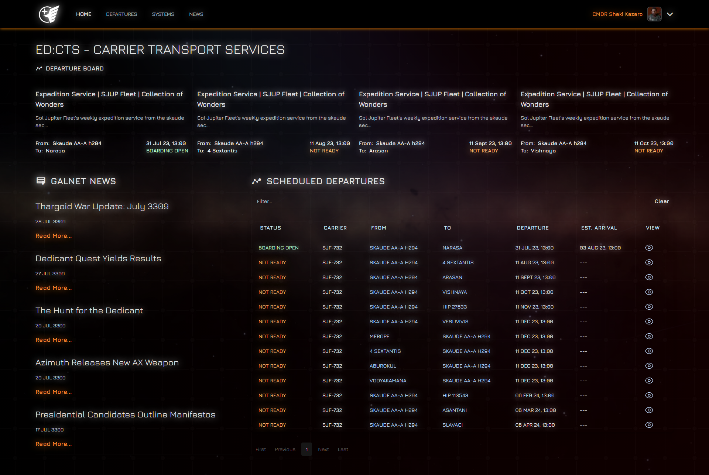
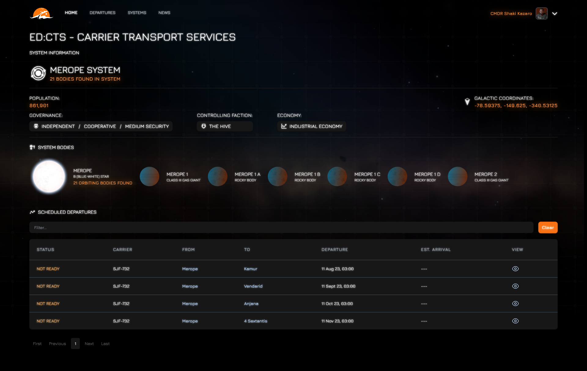

# ED:CTS - Carrier Transport Services

_Trainline, but for Elite Dangerous._

This is an arrival/departure information hub for fleet carrier journeys in Elite Dangerous.

  
  

## Development

ED:CTS is built with [nextJS](https://nextjs.org/) and [Typescript](https://www.typescriptlang.org/).

## Requirements

ED:CTS obtains all of its data and makes requests to EDSM through its [backend services](https://github.com/sentrychris/edcts).

To set up the backend, follow the instructions [here](https://github.com/sentrychris/edcts).

### Quick Start

1. Clone this repository
2. `npm install`
3. `npm run dev`

### Credits

- [iaincollinnns/icarus](https://github.com/iaincollins/icarus) - for UI inspiration, through this fantastic app - fonts, loaders and icons.
- [AnthorNet/EDSM](https://github.com/EDSM-NET) - for the wonderful cartographical data and API.
- [James Panter](https://codepen.io/jpanter/pen/PWWQXK) - for the loader animation.
