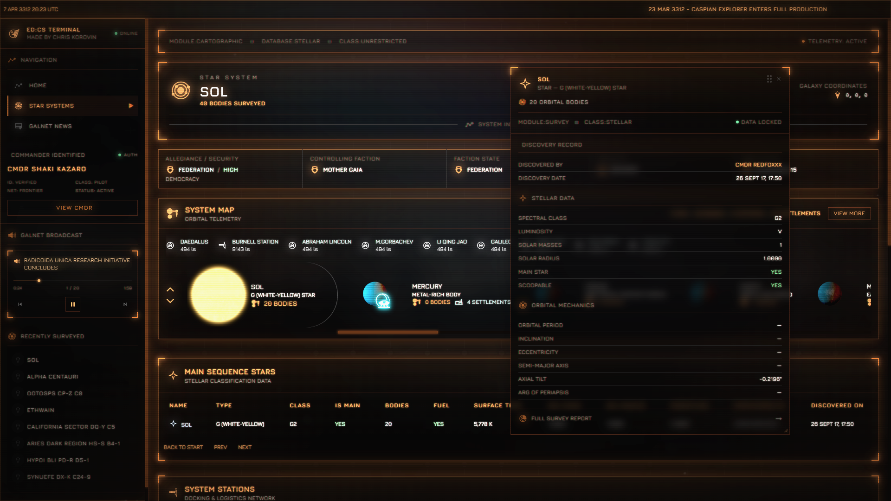

# ED:CTS - Carrier Transport Services

_Trainline, but for Elite Dangerous._

This is mainly an arrival/departure information hub for fleet carrier journeys in Elite Dangerous, but it also includes general system information, latest galnet news, and various other data sourced from EDDN, EDSM, Spansh and other third-party services.



## Development

ED:CTS is built with [nextJS](https://nextjs.org/) and [Typescript](https://www.typescriptlang.org/).


## Requirements

- ED:CTS backend services: https://github.com/sentrychris/edcts.

### Quick Start

Clone this repository:
```sh
git clone git@github.com:sentrychris/edcts-frontend.git
```

Copy `.env.example` to `.env` and update you environment variables:
```sh
cp .env.example .env
```

Run the development server
```sh
npm run dev
```

Buiild a production-ready release
```sh
npm run build
```

Run a production-ready release
```sh
npm start
```

Lint your code:
```sh
npm run lint
```

Format your code:
```sh
npm run prettier:fix
```

### Credits

ED:CTS wouldn't be possible without the work of hundreds of talented members of the Elite: Dangerous community.

_"Standing on the shoulders of giants"_.

Special thanks to:


- [ED:CD](https://edcd.github.io/)  - for all of their projects, data, guidance and more.
- [AnthorNet/EDSM](https://github.com/EDSM-NET) - for the wonderful data and API.
- [Spansh](https://www.spansh.co.uk) - for the wonderful data and API.
- [iaincollinnns/icarus](https://github.com/iaincollins/icarus) - for UI inspiration, through his fantastic app - fonts and icons.
- [James Panter](https://codepen.io/jpanter/pen/PWWQXK) - for the loader animation.

### Legal

"Elite", the Elite logo, the Elite: Dangerous logo, "Frontier" and the Frontier logo are registered trademarks of Frontier Developments plc. All rights reserved. All other trademarks and copyrights are acknowledged as the property of their respective owners.

Site assets are used in accordance with their respective licensing conditions or with the owner's permission, third party licenses can be found [here](./THIRD_PARTY_LICENSES).

ED:CTS is free, open source software released under the ISC License.